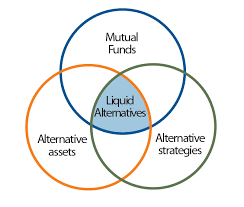
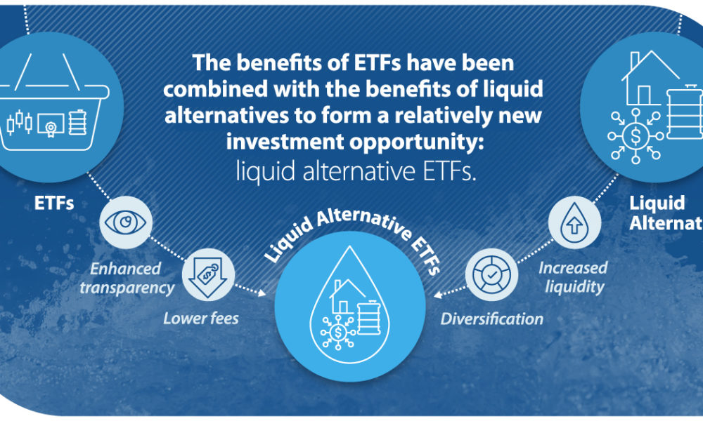

# So... what are “Liquid Alts”?
## 所以...什么是流动性替代品？

- [@大导演哈罗德(商务合作邮箱)](mailto:zhongfangyuan@link.cuhk.edu.cn): 香港中文大学（深圳）金融工程, [内容创作者](https://space.bilibili.com/629573485)

## 目录
- [So... what are “Liquid Alts”?](#so-what-are-liquid-alts)
  - [所以...什么是流动性替代品？](#所以什么是流动性替代品)
  - [目录](#目录)
  - [Liquid Alternatives (流动性替代品)](#liquid-alternatives-流动性替代品)
      - [What are Liquid Alternatives? (什么是流动性替代品(哈氏资产)？)](#what-are-liquid-alternatives-什么是流动性替代品哈氏资产)
    - [什么是流动性替代品?](#什么是流动性替代品)
- [流动性问题](#流动性问题)
- [Alternatives types （替代品类型）](#alternatives-types-替代品类型)
  - [什么是对冲基金策略？](#什么是对冲基金策略)
- [Reference](#reference)

## Liquid Alternatives (流动性替代品)
- a.k.a, liquid alts, alternative mutual funds, or alternative UCITS (Undertakings for Collective Investment in Transferable Securities)

- **中文解释：** 
  机构采用流动替代品的方式，作为获取对冲基金、房地产、私人股本和其他资产类别的风险敞口的一种手段 。ETF的收益与流动性替代品的收益相结合，形成了一个相对较新的投资机会，即流动性替代ETF

#### What are Liquid Alternatives? (什么是流动性替代品(哈氏资产)？)

Liquid alternative investments are typically benchmark unconstrained and aim to generate total or absolute returns. They often possess the ability to take both long and short positions. Key characteristics of liquid alternatives include:

- **Improved Liquidity (改善的流动性)**: These strategies provide access to traditional alternative asset classes with improved liquidity, such as daily, weekly, or twice monthly dealing.
- **Enhanced Governance (增强的治理)**: Liquid alternatives are subject to higher degrees of governance, outlining fund structure and management, and safeguarding underlying assets.
- **Diverse Investment Strategies (多样化的投资策略)**: These strategies offer genuine diversification within portfolios, reduced volatility, and potential downside protection in distressed markets.

### 什么是流动性替代品?

1. Improved Liquidity (流动性，流动性，还是流动性): 这些策略提供了改善流动性的传统替代资产类别的访问权限，例如每日、每周或每月两次的交易。(liquid alts基金和 liquid alts ETFs的小区别)
  
2. Enhanced Governance (增强的治理): 流动性替代品受到更高程度的治理，规定了基金结构和管理，并保护基础资产。

3. Diverse Investment Strategies (多样化的投资策略): 这些策略在投资组合中提供真正的多样化，降低波动性，并在困境市场中提供潜在的下行保护。
  
4. Regulated Mutual Fund Format (受监管的共同基金格式): 与传统替代投资不同，流动性替代品是在受监管的共同基金格式内构建的。这提供了更大的透明度、最低投资水平以及对杠杆和集中度的限制等好处。

总之，流动性替代品代表了提高均衡投资组合的风险调整回报的一种方式，为投资者提供了多样化、降低波动性和下行市场保护的组合。

# 流动性问题

- 流动性问题是投资者的一个重要考虑因素。传统的替代投资通常是不流动的，锁定期长达10年。
- 相比之下，流动性替代品提供了改善的流动性，每日、每周或每月两次的交易。这意味着投资者可以更轻松地获取他们的资金，并且还可以从更频繁地重新平衡他们的投资组合的能力中获益。
- 更别提流动性另类投资ETFs, 一天就可以买卖，而且还可以做空，这是传统的另类资产所不能做到的。

# Alternatives types （替代品类型）

- **Hedge Funds**: Hedge funds are a type of alternative investment that use pooled funds and employ different strategies to earn active returns, or alpha, for their investors. 
- **Commodities** Commodity trading advisors (CTAs) are professional investment managers, similar to portfolio managers in mutual funds, who trade a portfolio of assets in futures, options, forwards and/or OTC derivatives.

- **Venture Capital**
- **Real Estate**
- **Private Equity**

## 什么是对冲基金策略？

- 对冲基金是使用集合资金进行非常高风险的替代投资，采用多种不同的策略为投资者赚取主动回报或阿尔法。对冲基金可能采取积极管理的方式，或者在国内和国际市场上利用衍生品和杠杆，旨在产生高回报（无论是绝对回报还是相对于特定市场基准）。 

- 由于缺乏透明度，很难看到它是如何运作和管理的。

- 对冲基金通常只对符合条件的投资者开放，因为它们需要的美国证券交易委员会（SEC）监管较少。然而，受监管的共同基金流动性替代品对所有投资者都可用。

# Reference

- [What are Liquid Alternatives?](https://www.investopedia.com/terms/l/liquid-alternatives.asp)
- [Liquid Alternatives: A Guide to Alternative Mutual Funds](https://www.investopedia.com/articles/mutualfund/11/liquid-alternatives.asp) 
- [下一个投资前沿：流动性替代ETF 三大优势受机构青睐](https://finance.sina.cn/2019-11-25/detail-iihnzahi3117995.d.html)